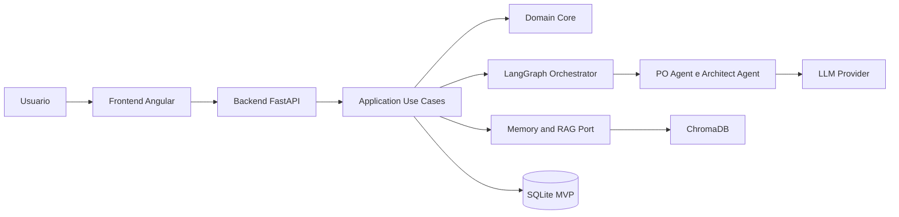

# Visão Arquitetural

## Contexto

Esta documentação descreve a arquitetura do MVP funcional do Idealize AI. A aplicação passa a validar o fluxo ponta a ponta com frontend Angular, backend FastAPI, memória RAG e persistência local suficiente para demonstração.

## Modelo Arquitetural Proposto

O backend deve adotar Clean Architecture como organização principal, combinada com elementos de Hexagonal Architecture para isolar integrações externas. A intenção é manter regras de negócio, casos de uso e contratos internos independentes de frameworks, provedores de IA, vector stores e mecanismos de persistência.

Essa abordagem é adequada porque o produto depende de integrações que tendem a evoluir: provedores LLM, LangGraph, ChromaDB, banco transacional, geração de documentos e interfaces HTTP. Ao tratar essas dependências como adaptadores, o núcleo da aplicação preserva estabilidade e testabilidade.

## Camadas Sugeridas

- Domínio: entidades, regras de negócio e conceitos centrais como projeto, insumo, etapa, artefato, épico e história de usuário.
- Aplicação: casos de uso responsáveis por conduzir fluxos, salvar insumos, recuperar contexto e gerar documentos.
- Portas: contratos para LLM, memória vetorial, repositórios, orquestração e geração documental.
- Adaptadores: FastAPI, LangGraph, ChromaDB, repositórios em memória, provedores LLM e exportadores de artefatos.
- Interface: frontend Angular para chat, formulários, dashboards e visualização de diagramas.

## Fluxo Conceitual

O usuário interage pelo frontend Angular. O backend FastAPI recebe comandos, aciona casos de uso e delega a orquestração de etapas ao LangGraph. Cada nó do grafo pode consultar memória semântica, chamar agentes de IA e persistir novos insumos. Os documentos finais são gerados a partir do estado consolidado do projeto e do contexto recuperado por RAG.

## Princípios

- O domínio não deve conhecer FastAPI, LangGraph, ChromaDB ou provedores LLM.
- Os casos de uso coordenam intenções de negócio e dependem de portas, não de implementações concretas.
- A orquestração com LangGraph deve ser encapsulada por adaptadores ou serviços de aplicação.
- O SQLite atende ao MVP funcional local, mas deve ser substituível por PostgreSQL sem alterar o domínio.
- A memória RAG deve manter rastreabilidade por projeto para fundamentar gerações futuras.
